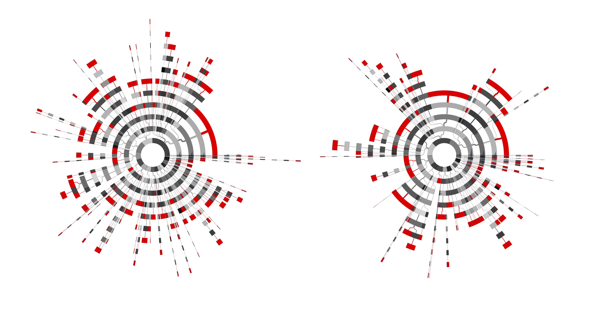
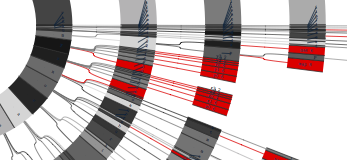

# sunburst

*preview of test.pdf*

*and up close*

*for an explanation of what a sunburst diagram is, [here's a good overview](http://www.datavizcatalogue.com/methods/sunburst_diagram.html)*

This is a side project I took on over the summer while at my internship with Tagup. 

ToDos:
- Refactor code for better efficency (had to get it out quickly while I still had access to a large scale printer)
